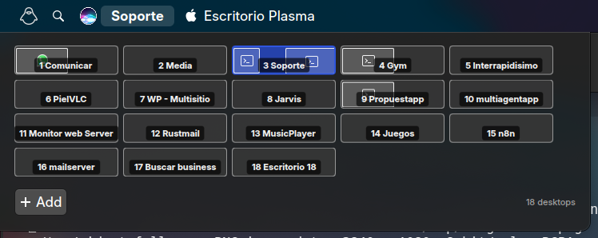

# Virtual Desktop Switcher

A KDE Plasma 5 widget that displays the current virtual desktop name and provides a visual overview of all desktops with real window positions.


## Features

- **Real-time desktop name** in panel - Shows active virtual desktop name
- **Hover to open** - Popup appears automatically when hovering (80ms delay)
- **Real window geometry** - Windows displayed in actual positions using native KDE pager API
- **Window icons** - Application icons shown inside window previews
- **Proper aspect ratio** - Desktop previews match your screen proportions
- **Grid layout** - Automatically arranges desktops in optimal columns/rows
- **Desktop management**:
  - Click to switch desktop
  - Right-click to rename or delete
  - Add new desktops with "Add" button
  - Scroll wheel to cycle through desktops
- **High performance** - Uses native `PagerModel` instead of shell commands

## Screenshots



The widget shows a grid of desktop previews with:
- Window outlines in real positions
- Application icons inside windows
- Desktop number and name badge
- Active desktop highlighted

## Installation

### Manual Installation

```bash
# Clone the repository
git clone https://github.com/andresgarcia0313/plasma-virtual-desktop-switcher.git

# Copy to Plasma plasmoids directory
cp -r plasma-virtual-desktop-switcher ~/.local/share/plasma/plasmoids/org.kde.virtualdesktopswitcher

# Restart Plasma
kquitapp5 plasmashell && kstart5 plasmashell
```

### Add to Panel

1. Right-click on your panel → **Add Widgets**
2. Search for **"Virtual Desktop Switcher"**
3. Drag to your panel

## Configuration

Right-click on the widget → **Configure Virtual Desktop Switcher**

| Option | Description |
|--------|-------------|
| Show window previews | Display window outlines inside desktop previews |
| Show window icons | Display application icons on window rectangles |
| Preview size | Adjust the size of preview area (40-150px) |

## Usage

| Action | Result |
|--------|--------|
| **Hover** | Opens desktop overview popup |
| **Click** on desktop | Switches to that desktop |
| **Right-click** on desktop | Context menu (Rename, Delete) |
| **Scroll wheel** | Cycles through desktops |
| **Add button** | Creates new virtual desktop |

## Requirements

- KDE Plasma 5.27 or later
- KWin window manager
- Qt 5.15+

## Technical Details

### Architecture

The widget uses the native KDE pager plugin (`org.kde.plasma.private.pager`) which provides:

- `PagerModel` - Virtual desktop model with real-time updates
- `TasksModel` - Window information including geometry
- `pagerItemSize` - Screen dimensions for aspect ratio

### Key Files

```
org.kde.virtualdesktopswitcher/
├── metadata.desktop          # Plugin metadata
├── contents/
│   ├── config/
│   │   ├── main.xml         # Configuration schema
│   │   └── config.qml       # Config page registration
│   └── ui/
│       ├── main.qml         # Main widget code
│       └── configGeneral.qml # Settings UI
```

### QML Imports Used

```qml
import org.kde.plasma.plasmoid 2.0
import org.kde.plasma.core 2.0 as PlasmaCore
import org.kde.plasma.components 3.0 as PlasmaComponents
import org.kde.plasma.private.pager 2.0  // Native pager API
```

### Window Geometry Scaling

Windows are scaled from screen coordinates to preview size:

```qml
readonly property real scaleX: deskW / pagerModel.pagerItemSize.width
readonly property real scaleY: deskH / pagerModel.pagerItemSize.height

x: Math.round(model.Geometry.x * scaleX)
y: Math.round(model.Geometry.y * scaleY)
```

## Development

### Testing Changes

```bash
# Edit files in
~/.local/share/plasma/plasmoids/org.kde.virtualdesktopswitcher/

# Restart Plasma to see changes
kquitapp5 plasmashell && kstart5 plasmashell
```

### Debugging

```bash
# View Plasma logs
journalctl -f | grep -i plasma

# Check QML errors
QT_LOGGING_RULES="qml.debug=true" plasmashell
```

### KWin D-Bus API

```bash
# List virtual desktops
gdbus call --session --dest org.kde.KWin \
  --object-path /VirtualDesktopManager \
  --method org.freedesktop.DBus.Properties.Get \
  org.kde.KWin.VirtualDesktopManager desktops

# Get current desktop
qdbus org.kde.KWin /VirtualDesktopManager current

# Rename desktop
qdbus org.kde.KWin /VirtualDesktopManager setDesktopName '<id>' 'New Name'

# Create desktop
qdbus org.kde.KWin /VirtualDesktopManager createDesktop <position> 'Name'

# Remove desktop
qdbus org.kde.KWin /VirtualDesktopManager removeDesktop '<id>'
```

## Contributing

Contributions are welcome! Please:

1. Fork the repository
2. Create a feature branch
3. Make your changes
4. Test thoroughly
5. Submit a pull request

## License

This project is licensed under the GPL-3.0 License - see the [LICENSE](LICENSE) file for details.

## Credits

- Uses KDE Plasma's native pager plugin for window geometry
- Inspired by the official KDE Pager widget

## Author

**Andres Garcia** - [GitHub](https://github.com/andresgarcia0313)
